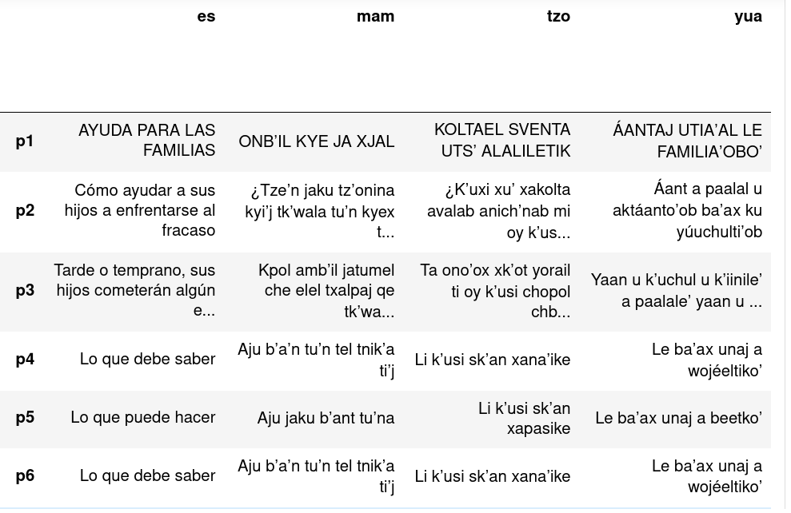
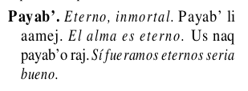

# Textos paralelos

Un __texto paralelo__ se refiere al conjunto de dos o más textos multilingües, alineados a nivel de frase, donde cada una de las frases alineadas corresponde a la traducción de las demás, en cada uno de los idiomas involucrados. El siguiente es un ejemplo de un texto paralelo en español, mam, tzotzil, y maya yucateco:

Los textos paralelos son necesarios para los sistemas modernos de TAN porque, para entrenarse, estos necesitan “ver” tanto texto como sea posible en todos los idiomas involucrados para aprender a traducir entre estos.

## Los vocabularios

Llamamos __vocabularios__ al conjunto de documentos en varios idiomas mayas, publicados en su mayoría por la Academia de Lenguas Mayas de Guatemala (ALMG), con excepción del tzeltal, que consisten en listados voces en la lengua maya y el español y ejemplos del uso de cada una de estas. El siguiente es un ejemplo de una entrada en el vocabulario mam:

Los vocabularios son un recurso muy valioso pues, además de tratarse de una colección de varios miles de frases en paralelo en diversas lenguas mayas, el registro lingüístico que utilizan corresponde al del uso más frecuente de los hablantes de cada comunidad lingüística. 

La extracción original de los vocabularios mayas, publicados por la ALMG en formato pdf de texto, fue llevada a cabo utilizando [`pdfplumber`](https://github.com/jsvine/pdfplumber) y mucha paciencia. 

La ALMG ha publicado muchos más textos mono y bilingües que con los que contamos actualmente. A continuación un listado de los documentos de los que podríamos extraer textos paralelos (omito los textos que no contienen más que listados de palabras aisladas):